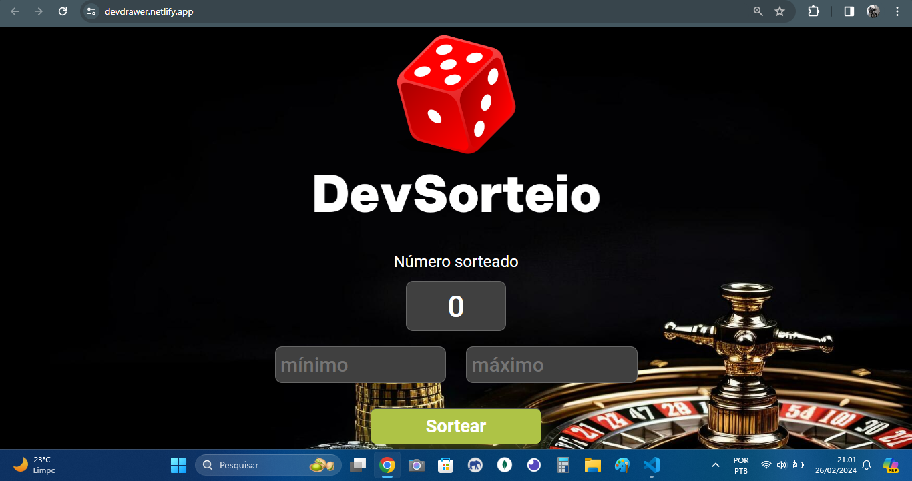

<h1>Sorteador</h1>

<b>Descrição:</b>

Projeto de sorteador, onde é inserido um número mínimo e um número máximo
e, através de uma função aleatória, é escolhido um número entre o mínimo e o
máximo

<b>Imagem ilustrativa de como ficou:</b>

    

O que foi feito ✅:
- [x] - Arquivo HTML
- [x] - Estilização com CSS
- [x] - Utilização de JavaScript para interação com os elementos

O que falta fazer ⚙️:
- [ ] - Adicionar função que faça com que o npumero não se repita
- [ ] - Div para abrigar os números que forem saindo, como se fosse um sorteio de bingo
- [ ] - No back, adicionar um array para abrigar os números que forem sorteados
- [ ] - Responsividade

<b>Tecnologias utilizadas 💻:<b/>

  
  
  

<b>Desenvolvido por:</b>

<table>
  <tr>
    <td align="center">
      <a href="https://github.com/gGtEriKk">
         
          
            <b>Erik Gomes</b>
          
      </a>
</table>